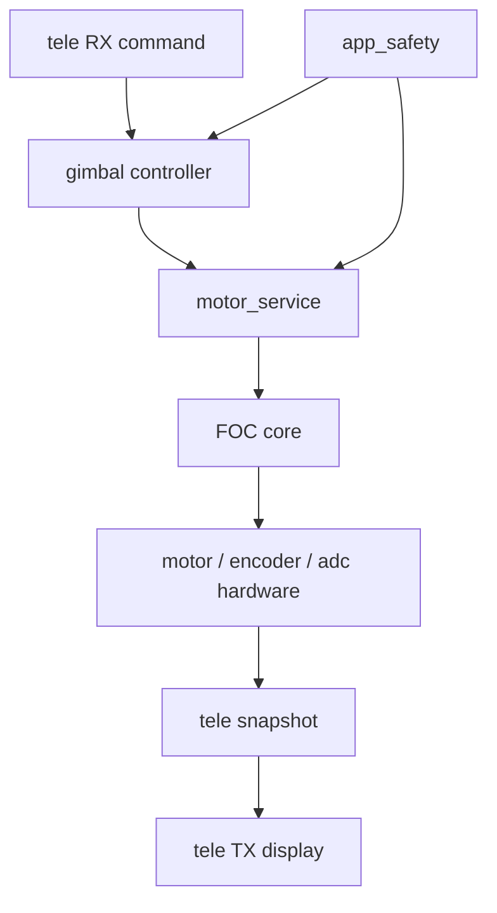

# Gimbal Control Line Draft

This note is a draft for the upper-level gimbal control canvas.
It sits above the existing FOC and tele/param chains.

## Current Canvas Structure

```text
gimbal_2axis.canvas
├── FOC/FOC.canvas
└── tele & param/tele.canvas
    ├── RX (tele cmd).canvas
    └── TX (tele display).canvas
```

## Existing Chains

### FOC Chain

- `foc_sensor_update`
- `foc_current_update`
- `foc_angle_control_tick`
- `foc_current_step`
- `foc_svpwm_write`
- `motor_bldc_set_pwm`

### Tele TX Chain

- `tele_snapshot_collect`
- `TELE_SNAPSHOT_FIELD`
- `tele_frame_fill`
- `justfloat_send`

### Tele RX Chain

- `HAL_UART_TxEventCallBack(huartx, size)`
- `justfloat_rx_feed`
- `tele_command_process_buffer`
- `tele_parse_command`
- `dispatch`
- `dispatch_action`

## Proposed Upper Gimbal Control Chain



## Node Roles

- `app_safety`: decides whether the system may run, clear faults, or stay latched.
- `gimbal_controller`: converts yaw/pitch commands into board-space target values.
- `motor_service`: owns motor enable, param access, open-loop state, and tuning boundary.
- `FOC core`: executes angle / current / torque / open-loop control.
- `tele_snapshot`: samples runtime state for display and debugging.

## Expected Coverage For The Missing Gimbal Layer

- mode entry and exit
- yaw / pitch target coordination
- center-angle handling
- target limiting and safety boundary
- mapping between host commands and motor_service actions
- snapshot fields that are specific to gimbal behavior

## Notes

- The existing tele and FOC chains are already documented as linear flows.
- The next canvas should focus on the relationship between host command,
  gimbal application logic, and motor service boundary.
- This draft is intentionally limited to structure. Implementation details
  remain in the codebase and the lower-level notes.
